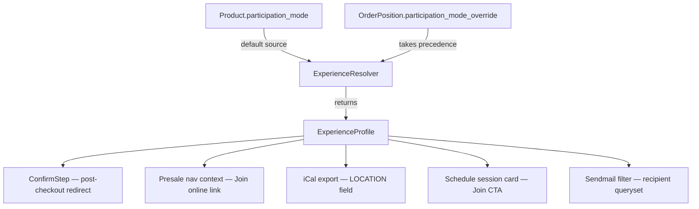
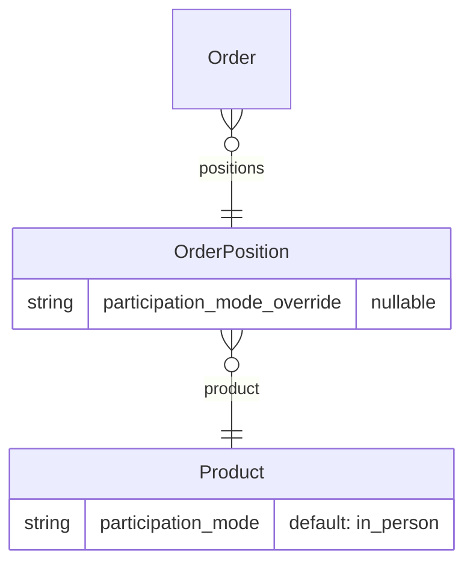

# Design Document: Hybrid Attendee Experience

## Overview

This feature introduces first-class support for hybrid event audiences in Eventyay. The core idea is simple: a ticket type (`Product`) carries a `participation_mode` that says whether it grants virtual or in-person access. A centralized `ExperienceResolver` service reads that mode (with optional per-position overrides) and returns an `ExperienceProfile` — a typed data object that drives all downstream UX decisions: post-checkout routing, navigation links, iCal location fields, schedule CTAs, and organizer email filters.

The design deliberately avoids scattering `if participation_mode == 'virtual'` checks across the codebase. All mode-dependent logic flows through the resolver, making future audience types (interpreters, post-event viewers, speakers) addable by registering a new handler rather than hunting for conditionals.

---

## Architecture



The resolver is a pure Python service class with no Django request dependency, making it safe to call from Celery tasks, management commands, and exporters.

---

## Components and Interfaces

### 1. `ParticipationMode` (choices)

**File:** `app/eventyay/base/models/choices.py`

```python
class ParticipationMode(models.TextChoices):
    VIRTUAL   = 'virtual',   _('Virtual (online)')
    IN_PERSON = 'in_person', _('In-person')
```

Using `TextChoices` with a `CharField(max_length=50)` means new values can be appended without a destructive migration.

---

### 2. `Product.participation_mode` field

**File:** `app/eventyay/base/models/product.py`

New field added to the `Product` model:

```python
participation_mode = models.CharField(
    max_length=50,
    choices=ParticipationMode.choices,
    default=ParticipationMode.IN_PERSON,
    verbose_name=_('Participation mode'),
    help_text=_('Whether this ticket grants virtual (online) or in-person access.'),
)
```

A Django migration is required. The field defaults to `in_person` so all existing products remain unchanged.

The product copy logic in `app/eventyay/control/forms/product.py` already copies all model fields by default; no extra change is needed there, but the field must be added to the copy exclusion list if it should not be copied (it should be copied, so no action needed).

---

### 3. `OrderPosition.participation_mode_override` field

**File:** `app/eventyay/base/models/orders.py`

```python
participation_mode_override = models.CharField(
    max_length=50,
    choices=ParticipationMode.choices,
    null=True,
    blank=True,
    verbose_name=_('Participation mode override'),
    help_text=_('If set, overrides the product-level participation mode for this position.'),
)
```

A second migration is required for this field.

---

### 4. `ExperienceProfile` dataclass

**File:** `app/eventyay/base/services/experience_resolver.py`

```python
from dataclasses import dataclass, field
from typing import Optional

@dataclass
class ExperienceProfile:
    participation_mode: str
    has_stream_access: bool
    show_join_online_nav: bool
    primary_cta_url: Optional[str] = None
    calendar_location: Optional[str] = None
```

Using `@dataclass` with typed fields means callers that only use existing fields are unaffected when new fields are added with defaults.

---

### 5. `ExperienceResolver` service

**File:** `app/eventyay/base/services/experience_resolver.py`

```python
class ExperienceResolver:
    """
    Computes an ExperienceProfile for a given OrderPosition.
    No Django request object is required.
    """

    # Registry: participation_mode value → builder method name
    _HANDLERS: dict[str, str] = {
        ParticipationMode.VIRTUAL:   '_build_virtual_profile',
        ParticipationMode.IN_PERSON: '_build_in_person_profile',
    }

    def resolve(self, position: OrderPosition, event=None) -> ExperienceProfile:
        if position.product_id is None:
            raise ValueError(
                f'OrderPosition {position.pk} has no associated Product; '
                'cannot resolve experience profile.'
            )
        mode = position.participation_mode_override or position.product.participation_mode
        handler_name = self._HANDLERS.get(mode)
        if handler_name is None:
            raise ValueError(
                f'Unknown participation_mode "{mode}" on OrderPosition {position.pk}. '
                'Register a handler in ExperienceResolver._HANDLERS.'
            )
        return getattr(self, handler_name)(position, event)

    def _build_virtual_profile(self, position, event) -> ExperienceProfile:
        stream_url = self._get_stream_url(position, event)
        return ExperienceProfile(
            participation_mode=ParticipationMode.VIRTUAL,
            has_stream_access=True,
            show_join_online_nav=True,
            primary_cta_url=stream_url,
            calendar_location=stream_url or self._get_event_url(position, event),
        )

    def _build_in_person_profile(self, position, event) -> ExperienceProfile:
        return ExperienceProfile(
            participation_mode=ParticipationMode.IN_PERSON,
            has_stream_access=False,
            show_join_online_nav=False,
            primary_cta_url=None,
            calendar_location=str(event.location) if event and event.location else None,
        )

    def _get_stream_url(self, position, event) -> Optional[str]:
        # Returns the stream/video page URL for the event, or None if not configured.
        # Uses eventyay.multidomain.urlreverse.build_absolute_uri
        ...

    def _get_event_url(self, position, event) -> str:
        ...
```

**Extensibility:** To add a new mode (e.g. `interpreter`), a developer:
1. Adds `INTERPRETER = 'interpreter', _('Interpreter')` to `ParticipationMode`.
2. Adds `'interpreter': '_build_interpreter_profile'` to `_HANDLERS`.
3. Implements `_build_interpreter_profile`.

No existing code changes required.

---

### 6. Post-checkout routing — `ConfirmStep`

**File:** `app/eventyay/presale/checkoutflowstep/confirm_step.py`

Override `get_success_url` to inspect the resolved profiles:

```python
def get_success_url(self, value):
    order = Order.objects.get(id=value)
    resolver = ExperienceResolver()
    try:
        profiles = [
            resolver.resolve(pos, order.event)
            for pos in order.positions.select_related('product').all()
        ]
        all_virtual = all(p.has_stream_access for p in profiles)
        stream_url = profiles[0].primary_cta_url if profiles else None
        if all_virtual and stream_url:
            return stream_url
    except (ValueError, Exception):
        logger.warning('ExperienceResolver failed for order %s; falling back.', order.code)
    return self.get_order_url(order)
```

---

### 7. Navigation personalisation — presale context

**File:** `app/eventyay/presale/context.py`

Inject `show_join_online_nav` and `join_online_url` into the presale template context by resolving the authenticated user's active OrderPosition for the event.

```python
def get_presale_context(request, event):
    ctx = { ... }  # existing context
    ctx['show_join_online_nav'] = False
    ctx['join_online_url'] = None
    if request.user.is_authenticated:
        with scope(event=event):
            pos = (
                OrderPosition.objects
                .filter(
                    order__event=event,
                    order__status__in=[Order.STATUS_PAID, Order.STATUS_PENDING],
                    order__email__iexact=request.user.email,
                    canceled=False,
                )
                .select_related('product')
                .first()
            )
        if pos:
            try:
                profile = ExperienceResolver().resolve(pos, event)
                ctx['show_join_online_nav'] = profile.show_join_online_nav
                ctx['join_online_url'] = profile.primary_cta_url
            except ValueError:
                pass
    return ctx
```

Template usage (Jinja2):
```html

  <a href="{{ join_online_url }}" class="nav-link"></a>

```

---

### 8. iCal export personalisation

**File:** `app/eventyay/presale/ical.py`

Extend `get_ical` to accept an optional `position` parameter:

```python
def get_ical(events, position=None):
    ...
    for ev in events:
        ...
        location = None
        if position is not None:
            try:
                profile = ExperienceResolver().resolve(position, event)
                location = profile.calendar_location
            except ValueError:
                pass
        if location is None and ev.location:
            location = str(ev.location)
        if location:
            vevent.add('location').value = location
```

Existing callers that pass only `events` are unaffected (backward compatible).

---

### 9. Schedule session card

**File:** `app/eventyay/schedule/` templates and context

The schedule view already fetches session data. The context processor adds the attendee's `participation_mode` (or `None` for unauthenticated). Templates use this to conditionally render a "Join" button vs. room/location text:

```html

  <a href="{{ session.stream_url }}" class="btn btn-primary"></a>

  <span class="session-location">{{ session.room }}</span>

```

No extra per-session DB queries: `attendee_participation_mode` is resolved once per page load and passed as a template variable.

---

### 10. Sendmail participation mode filter

**File:** `app/eventyay/plugins/sendmail/forms.py` and `views.py`

Add an optional `participation_mode` field to `MailForm`:

```python
participation_mode = forms.ChoiceField(
    choices=[('', _('All attendees'))] + ParticipationMode.choices,
    required=False,
    label=_('Participation mode'),
    help_text=_('Filter recipients by their effective participation mode.'),
)
```

In `SenderView.form_valid`, after building `opq`:

```python
pm_filter = form.cleaned_data.get('participation_mode')
if pm_filter:
    # Filter by override first, fall back to product-level mode
    opq = opq.filter(
        Q(participation_mode_override=pm_filter) |
        Q(participation_mode_override__isnull=True, product__participation_mode=pm_filter)
    )
```

This composes correctly with all existing filters because it is an additional `.filter()` on the same `opq` queryset.

---

## Data Models

### Migration 1 — `Product.participation_mode`

```
app/eventyay/base/migrations/XXXX_product_participation_mode.py
```

- `AddField` on `base.Product`: `participation_mode`, `CharField(max_length=50, default='in_person')`
- Non-destructive; all existing rows get `in_person`.

### Migration 2 — `OrderPosition.participation_mode_override`

```
app/eventyay/base/migrations/XXXX_orderposition_participation_mode_override.py
```

- `AddField` on `base.OrderPosition`: `participation_mode_override`, `CharField(max_length=50, null=True, blank=True)`
- Non-destructive; all existing rows get `NULL`.

### ER Diagram (relevant portion)



---

## Correctness Properties

*A property is a characteristic or behavior that should hold true across all valid executions of a system — essentially, a formal statement about what the system should do. Properties serve as the bridge between human-readable specifications and machine-verifiable correctness guarantees.*

---

Property 1: ExperienceProfile flags match participation mode
*For any* OrderPosition whose effective participation mode is `virtual`, the resolved `ExperienceProfile` must have `has_stream_access=True` and `show_join_online_nav=True`; for any position resolving to `in_person`, both flags must be `False`.
**Validates: Requirements 3.3, 3.4**

---

Property 2: Resolver override precedence
*For any* OrderPosition, when `participation_mode_override` is set, the resolved mode equals the override; when it is `None`, the resolved mode equals `product.participation_mode`.
**Validates: Requirements 2.2, 2.3**

---

Property 3: ExperienceProfile structural completeness
*For any* valid OrderPosition, the object returned by `ExperienceResolver.resolve()` must be an `ExperienceProfile` instance with all five required fields present and correctly typed (`participation_mode: str`, `has_stream_access: bool`, `show_join_online_nav: bool`, `primary_cta_url: str | None`, `calendar_location: str | None`).
**Validates: Requirements 3.1, 3.2**

---

Property 4: Post-checkout redirect is stream page iff all positions are virtual and stream URL exists
*For any* completed Order, the `get_success_url` result equals the stream page URL if and only if every OrderPosition in the order resolves to `virtual` AND a stream URL is configured; otherwise it equals the order confirmation URL.
**Validates: Requirements 4.1, 4.2**

---

Property 5: iCal LOCATION round-trip
*For any* OrderPosition passed to `get_ical`, the `LOCATION` field in the generated `VEVENT` must equal `ExperienceProfile.calendar_location` for that position (or the event location if `calendar_location` is `None`).
**Validates: Requirements 6.1, 6.2, 6.3**

---

Property 6: iCal backward compatibility
*For any* `Event` object passed to `get_ical` without a position argument, the generated `VEVENT` must be identical to the output produced before this feature was introduced (i.e. uses `ev.location` directly).
**Validates: Requirement 6.5**

---

Property 7: Sendmail participation mode filter correctness
*For any* set of OrderPositions and any non-empty `participation_mode` filter value, every position in the filtered queryset must have an effective participation mode equal to the filter value, and no position with a different effective mode must appear.
**Validates: Requirements 8.2, 8.3**

---

Property 8: Sendmail filter composability (metamorphic)
*For any* combination of existing Sendmail filters plus a participation mode filter, the result set must be a subset of the result set produced by the existing filters alone (adding the participation filter can only reduce or maintain the count, never increase it).
**Validates: Requirement 8.5**

---

Property 9: Product participation_mode persistence round-trip
*For any* valid `ParticipationMode` value, setting `product.participation_mode` to that value, saving, and reloading from the database must yield the same value.
**Validates: Requirements 1.1, 1.2**

---

Property 10: Product copy inherits participation_mode
*For any* Product with any `participation_mode`, the copied/duplicated Product must have the same `participation_mode` as the source.
**Validates: Requirement 1.4**

---

## Error Handling

| Scenario | Behaviour |
|---|---|
| `OrderPosition` has no `product` | `ExperienceResolver.resolve()` raises `ValueError` with descriptive message |
| Unknown `participation_mode` value | `ExperienceResolver.resolve()` raises `ValueError` with descriptive message |
| Stream URL cannot be resolved | `_get_stream_url` returns `None`; caller falls back gracefully |
| `get_success_url` resolver failure | Logs `WARNING`, returns standard order confirmation URL |
| iCal resolver failure | Logs `WARNING`, falls back to `ev.location` |
| Sendmail filter with unknown mode | Form validation rejects the value before it reaches the queryset |

All `ValueError` exceptions from the resolver are specific and must not be caught as generic `Exception` in production paths — only in the fallback wrappers in `ConfirmStep` and `get_ical`.

---

## Testing Strategy

### Unit tests (`app/tests/`)

Unit tests cover specific examples, edge cases, and error conditions:

- `ExperienceResolver` raises `ValueError` for missing product (Requirement 3.6)
- `ExperienceResolver` raises `ValueError` for unknown mode (Requirement 9.3)
- `ExperienceResolver` is callable without a request object (Requirement 3.5)
- `ConfirmStep.get_success_url` falls back when stream URL is absent (Requirement 4.3)
- `ConfirmStep.get_success_url` falls back when resolver raises (Requirement 4.4)
- `get_ical` with plain `Event` (no position) produces unchanged output (Requirement 6.5)
- `get_ical` with virtual position uses stream URL as LOCATION (Requirement 6.1)
- Sendmail form includes `participation_mode` field (Requirement 8.1)
- `ParticipationMode` is a `TextChoices` subclass (Requirement 9.1)
- `ExperienceProfile` is a typed dataclass (Requirement 9.4)

### Property-based tests

Use **Hypothesis** (already available in the Python ecosystem; add to `pyproject.toml` dev dependencies if not present).

Each property test runs a minimum of 100 iterations. Each test is tagged with a comment referencing the design property.

```
# Feature: hybrid-attendee-experience, Property N: <property text>
```

- **Property 1** — Generate random `(virtual | in_person)` positions; assert profile flags match.
- **Property 2** — Generate positions with and without override; assert resolver precedence.
- **Property 3** — Generate any valid position; assert returned object is `ExperienceProfile` with all fields typed correctly.
- **Property 4** — Generate orders with random mixes of virtual/in_person positions; assert redirect URL rule.
- **Property 5** — Generate positions with known modes; call `get_ical`; assert LOCATION matches profile.
- **Property 6** — Generate `Event` objects; call `get_ical` without position; assert output unchanged.
- **Property 7** — Generate position sets with mixed modes; apply filter; assert all results match filter.
- **Property 8** — Generate position sets; apply existing filters then add participation filter; assert result is subset.
- **Property 9** — Generate any `ParticipationMode` value; save Product; reload; assert round-trip.
- **Property 10** — Generate Product with any mode; copy; assert copied mode matches.
