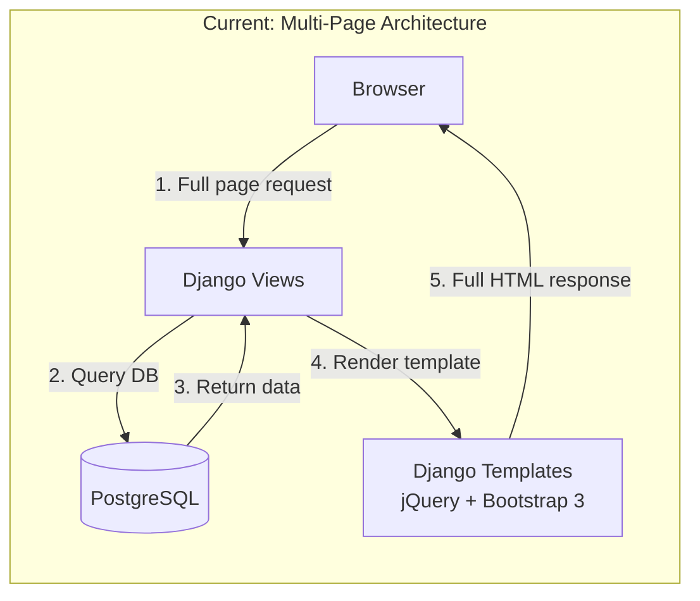
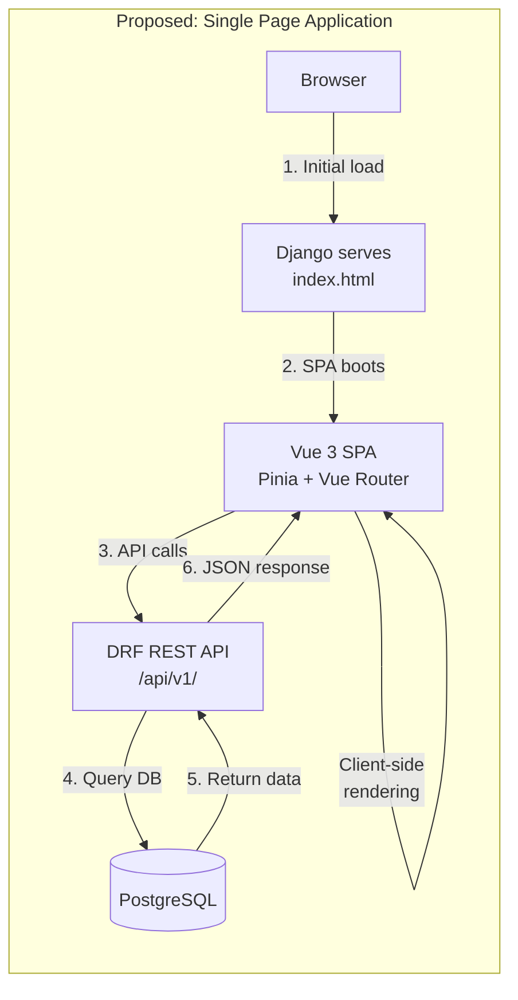
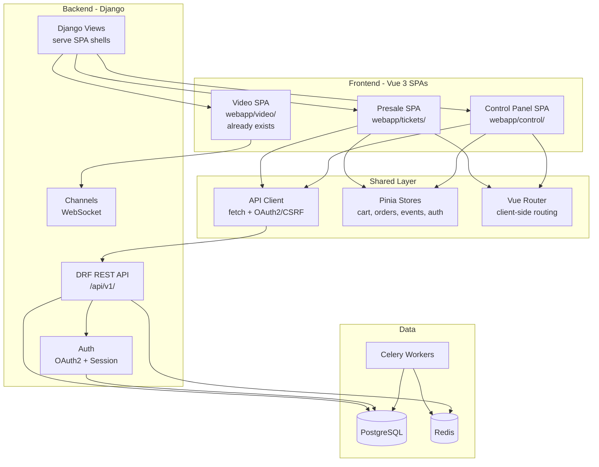
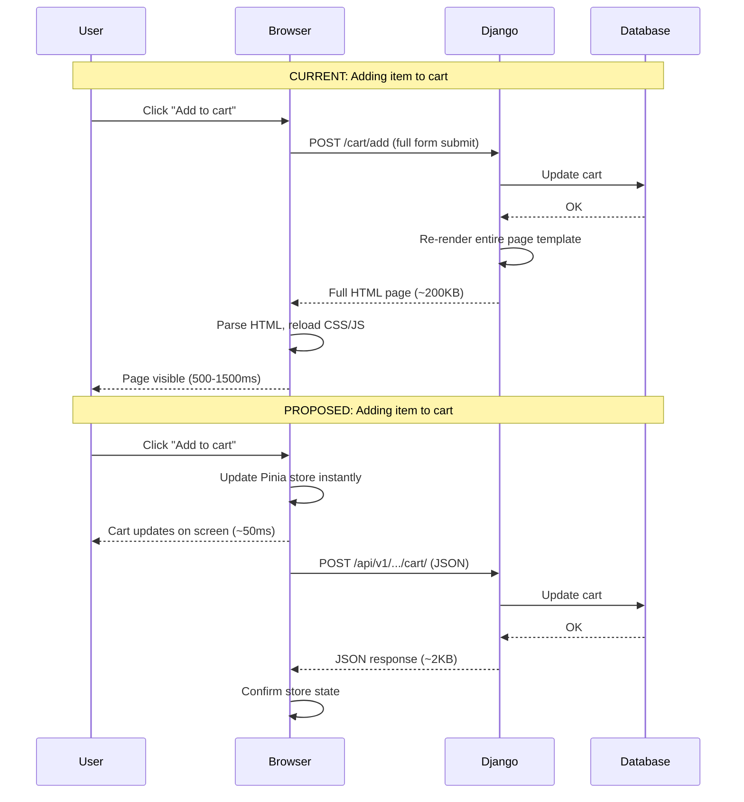

# Architecture Diagram (for proposal appendix)

Render this with any Mermaid renderer (mermaid.live, GitHub markdown preview, etc.) and screenshot it for the PDF.

## Current Architecture

## Proposed Architecture

## Full System View (both SPAs)

## Page Load Comparison

