HubSpot Integration
===================

The **HubSpot Integration** plugin automatically transfers order and attendee data from Eventyay to your HubSpot CRM. When an order is placed or updated, the plugin pushes the relevant data to HubSpot as Contacts and/or Deals, keeping your CRM in sync with your event registrations.

.. contents:: On this page
   :local:
   :depth: 2

Connecting to HubSpot
---------------------

The plugin uses OAuth to securely connect Eventyay to your HubSpot account. You can connect at two levels: for a single event, or for your entire organizer account.

Organizer-level connection
^^^^^^^^^^^^^^^^^^^^^^^^^^

Connecting at the organizer level shares a single HubSpot connection across all events under that organizer. This is the recommended approach if all your events use the same HubSpot account.

1. In the Eventyay backend, go to your **Organizer** dashboard.
2. Click **HubSpot** in the left sidebar.
3. Use the toggle in the top-right corner to enable the integration.

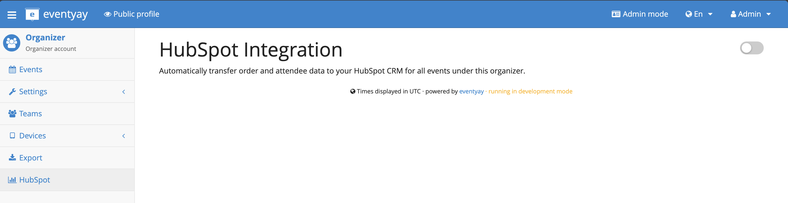

4. Click **Connect to HubSpot**.

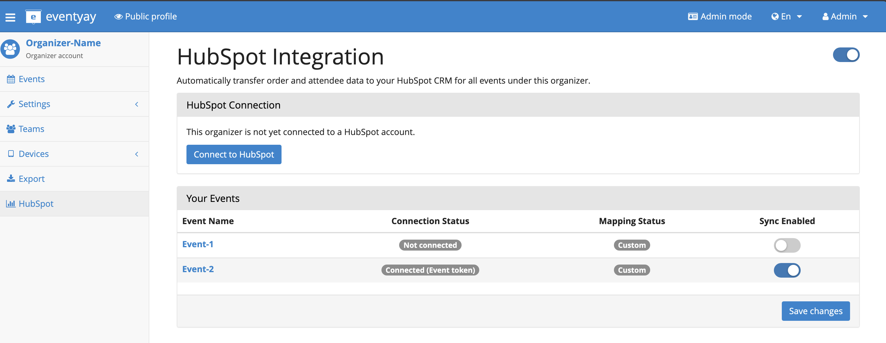

Once connected, the organizer page shows:

- The **HubSpot Connection** panel displaying the connected portal name and a **Disconnect** button.
- A **Your Events** table listing each event under this organizer, with columns for:

  - **Connection Status** -- Whether the event is ``Not connected``, ``Connected (Event token)`` (has its own token), or ``Connected (Organizer fallback)`` (uses the organizer's token).
  - **Mapping Status** -- ``Custom`` if the event has its own object/field mappings configured, or ``Organizer default`` otherwise.
  - **Sync Enabled** -- A per-event toggle to enable or disable synchronization for that specific event.

Click **Save changes** at the bottom to persist the per-event sync toggles.

Event-level connection
^^^^^^^^^^^^^^^^^^^^^^

If you need to connect a specific event to a *different* HubSpot account, you can connect directly from the event dashboard:

1. Go to your Event dashboard.
2. Click **Hubspot** in the left sidebar.
3. Click **Connect** in the HubSpot Connection panel.

OAuth flow
^^^^^^^^^^

When you click Connect (at either level), you are redirected to HubSpot's authorization page:

**Step 1:** Choose to sign in to an existing HubSpot account or create a new one.

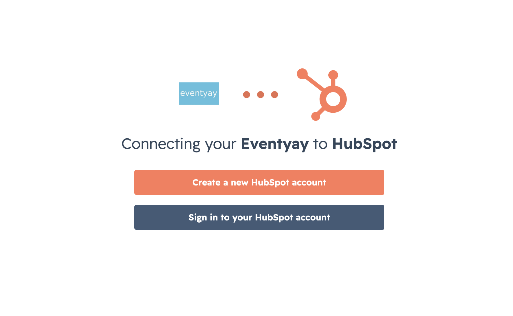

**Step 2:** Select which HubSpot portal to connect.

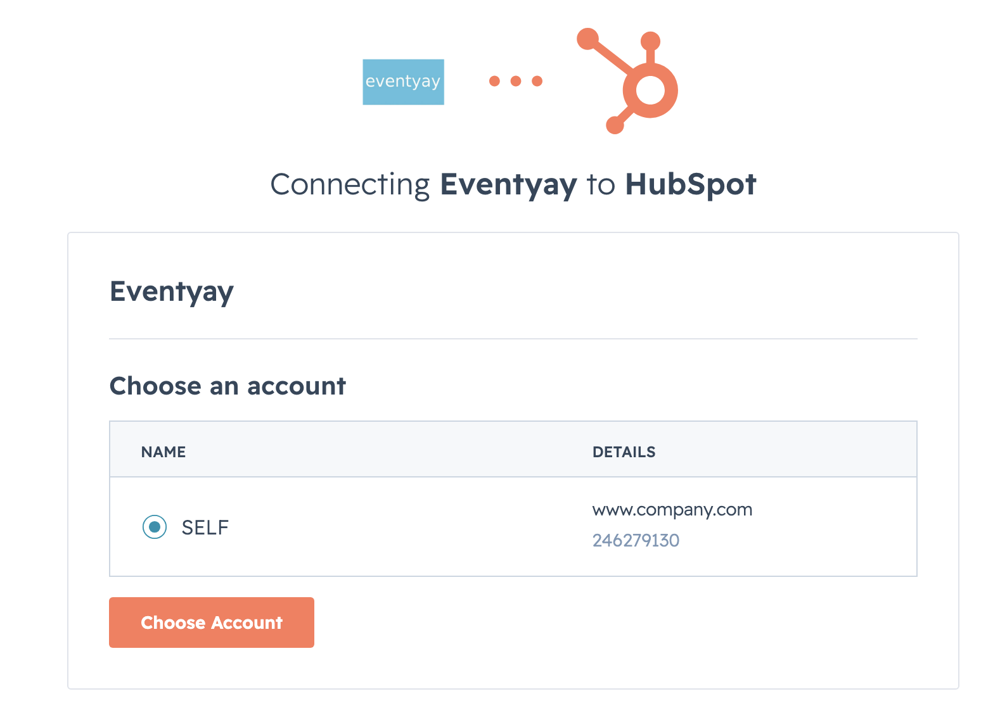

**Step 3:** Review the permissions Eventyay is requesting. The plugin needs access to view and modify Contacts and Deals.

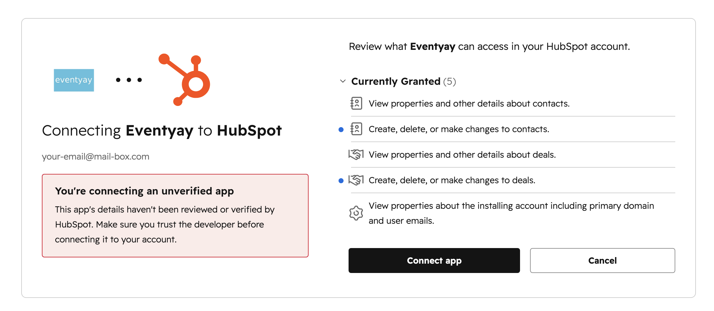

**Step 4:** If the app is not yet verified by HubSpot, you will see a risk confirmation dialog. Type ``I accept the risk`` and click **Connect** to proceed.

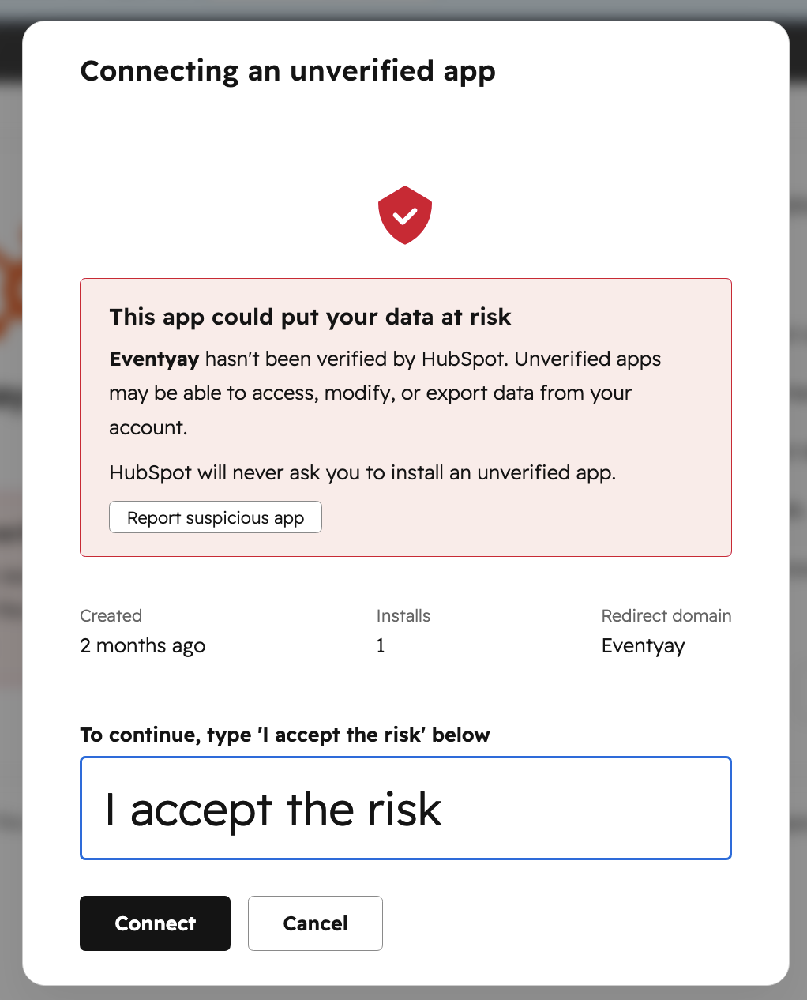

After authorization, you are redirected back to Eventyay and the connection status updates to show the connected portal.

Event HubSpot settings
----------------------

After connecting, the event-level HubSpot page is divided into several sections: the connection panel, object mappings, sync mapping settings, and recent activity.

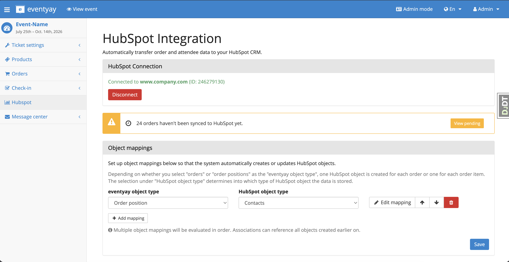

HubSpot Connection
^^^^^^^^^^^^^^^^^^

At the top you can see the connected HubSpot portal (domain and ID) and a red **Disconnect** button. If there are unsynced orders, a yellow warning banner appears (e.g. *"24 orders haven't been synced to HubSpot yet"*) with a **View pending** link to the Sync Problems page.

Object mappings
^^^^^^^^^^^^^^^

Object mappings define *what type* of Eventyay data maps to *what type* of HubSpot object:

- **Eventyay object type** -- Either ``Order`` (one HubSpot object per order) or ``Order position`` (one HubSpot object per attendee/ticket within an order).
- **HubSpot object type** -- Either ``Contacts`` or ``Deals``.

For example, mapping **Order position** to **Contacts** means that each attendee in an order creates or updates a Contact in HubSpot.

You can:

- Click **+ Add mapping** to create additional mappings (e.g. also map Orders to Deals).
- Use the arrow buttons to reorder mappings. Multiple object mappings are evaluated in order, and associations can reference objects created by earlier mappings.
- Click **Edit mapping** to configure the field-level mapping for that object type.
- Click the red trash icon to delete a mapping.
- Click **Save** to persist changes.

Sync Mapping
^^^^^^^^^^^^

Below the object mappings, the Sync Mapping section controls *how* synchronization runs.

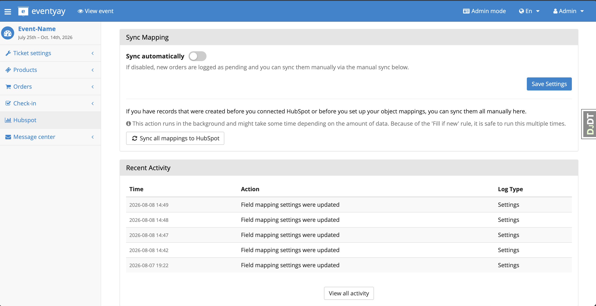

- **Sync automatically** -- When enabled, new paid orders are automatically synced to HubSpot in the background. When disabled, orders are logged as pending and can be synced manually.
- **Save Settings** -- Persists the auto-sync toggle.
- **Sync all mappings to HubSpot** -- A manual action that syncs all existing records. Use this to backfill records that were created before the plugin was connected or before object mappings were configured. This runs in the background and is safe to execute multiple times thanks to the *Fill if new* sync mode.

Recent Activity
^^^^^^^^^^^^^^^

A table showing the most recent audit log entries (e.g. *"Field mapping settings were updated"*) with timestamps and log type. Click **View all activity** to open the full Activity Log page.

Field mapping
-------------

After creating an object mapping, click **Edit mapping** to configure how individual fields map between Eventyay and HubSpot.

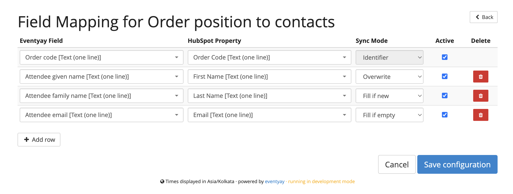

Each row has four columns:

Eventyay Field
   The source data from Eventyay. This dropdown lists all available fields for the selected object type, including built-in fields (Order code, Attendee given name, Attendee email, etc.) and any custom questions you have configured on your event.

HubSpot Property
   The target property in HubSpot. This dropdown is populated from your HubSpot account's actual properties, so you can also map to any custom properties you have created in HubSpot.

Sync Mode
   Controls how the plugin handles the data during synchronization:

   - **Identifier** -- This field uniquely identifies the record in HubSpot. Used to find existing records and prevent duplicates. For Contacts, this is typically the email address. For Deals, the order code. You should always have exactly one Identifier row per mapping.
   - **Overwrite** -- Always update the HubSpot property with the current Eventyay value, even if the property already has data.
   - **Fill if new** -- Only write this value when *creating* a new record. If the record already exists in HubSpot, this field is not updated. Useful for preserving manual edits made in HubSpot.
   - **Fill if empty** -- Only write this value if the HubSpot property is currently empty. If it already has a value, Eventyay leaves it untouched.

Active
   A checkbox to enable or disable the field mapping row without deleting it.

Delete
   Click the red trash icon to remove a field mapping row.

Click **+ Add row** to add another field mapping. Click **Save configuration** when done.

Activity Log
------------

The Activity Log provides a full history of all HubSpot-related actions for your event, combining both sync operations and settings changes into one view.

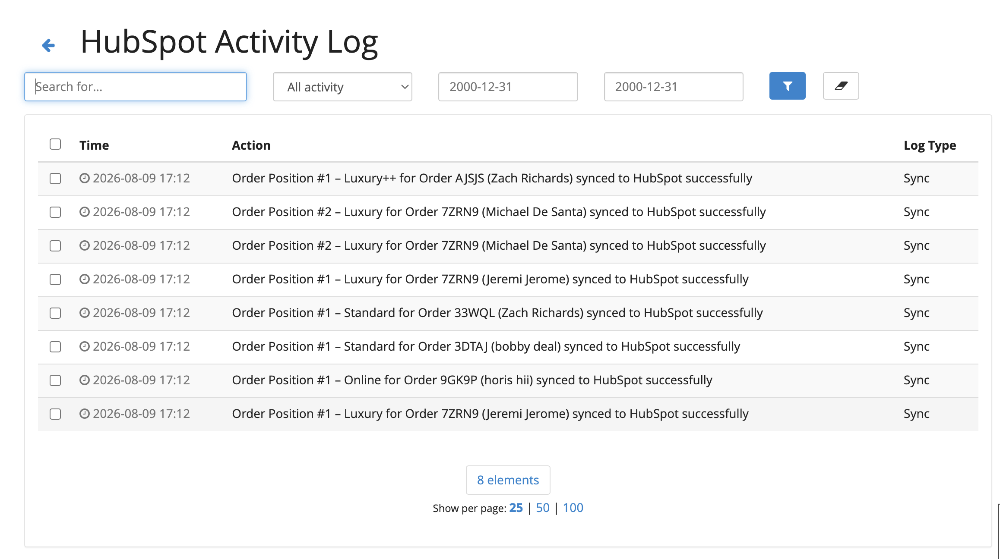

The log page provides:

- **Search** -- Free-text search across log entries.
- **Filter by type** -- Filter to show only sync activities, only settings changes, or all.
- **Date range** -- Filter by date range to narrow results.
- **Log Type** column -- Shows whether the entry is a ``Sync`` event (e.g. "Order Position #1 synced to HubSpot successfully") or a ``Settings`` event (e.g. "Field mapping settings were updated").
- **Pagination** -- Results are paginated with configurable page sizes (25, 50, 100).
- **Bulk delete** -- Select individual log entries (or all) and delete them.

Sync Problems
-------------

If synchronization fails for any record, the **Sync Problems** page shows you exactly what went wrong and lets you take action.

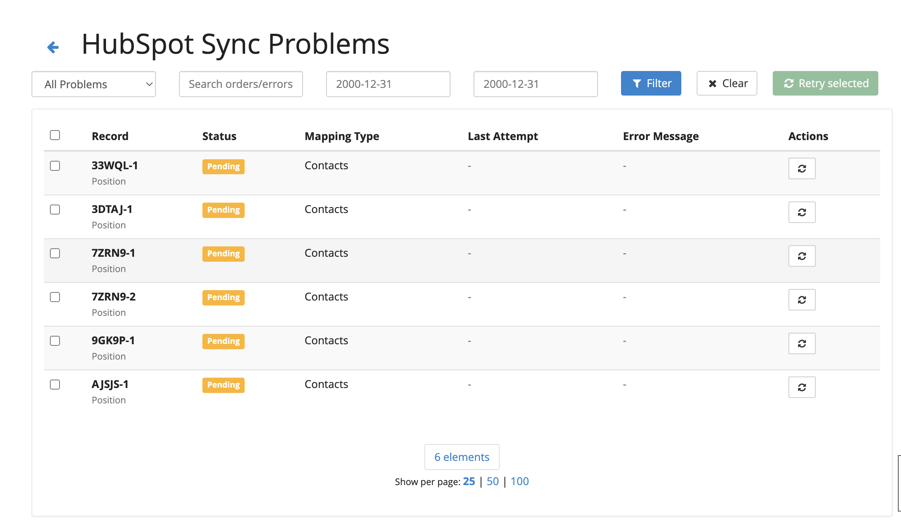

Each row shows:

- **Record** -- The order code and position number (e.g. ``33WQL-1``), with the record type (``Position``) below it.
- **Status** -- Either ``Pending`` (not yet attempted) or ``Failed`` (sync was attempted and returned an error).
- **Mapping Type** -- Which HubSpot object this record maps to (e.g. ``Contacts``).
- **Last Attempt** -- When the last sync was tried.
- **Error Message** -- A description of what went wrong (e.g. authentication failure, invalid field data, duplicate record).
- **Actions** -- A retry button to re-queue the individual record for sync.

The page also provides:

- **Filter toolbar** -- Filter by status (All Problems, Pending, Failed), search by order code or error text, and filter by date range.
- **Retry selected** -- Select multiple records using the checkboxes and click the green **Retry selected** button to bulk-retry them.
- **Dismiss** -- For failed records, you can dismiss the error if you no longer want to sync that particular record.

Disconnecting
-------------

To disconnect HubSpot:

- **Event level:** Click the red **Disconnect** button in the HubSpot Connection panel on the event page. This revokes the OAuth token at HubSpot and disables sync for that event.
- **Organizer level:** Click **Disconnect** on the organizer HubSpot page. This revokes the organizer token and disables sync for all events that were using the organizer-level connection (events with their own event-level tokens are unaffected).
