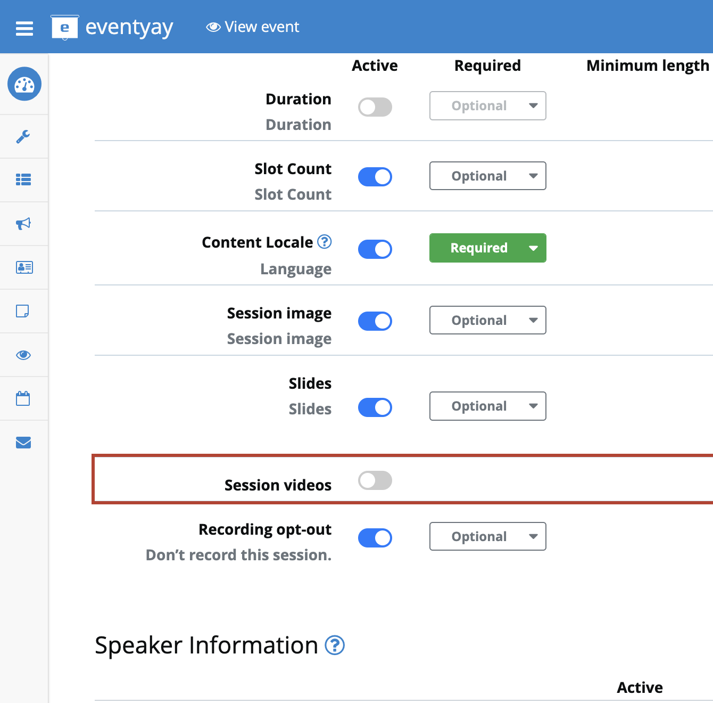
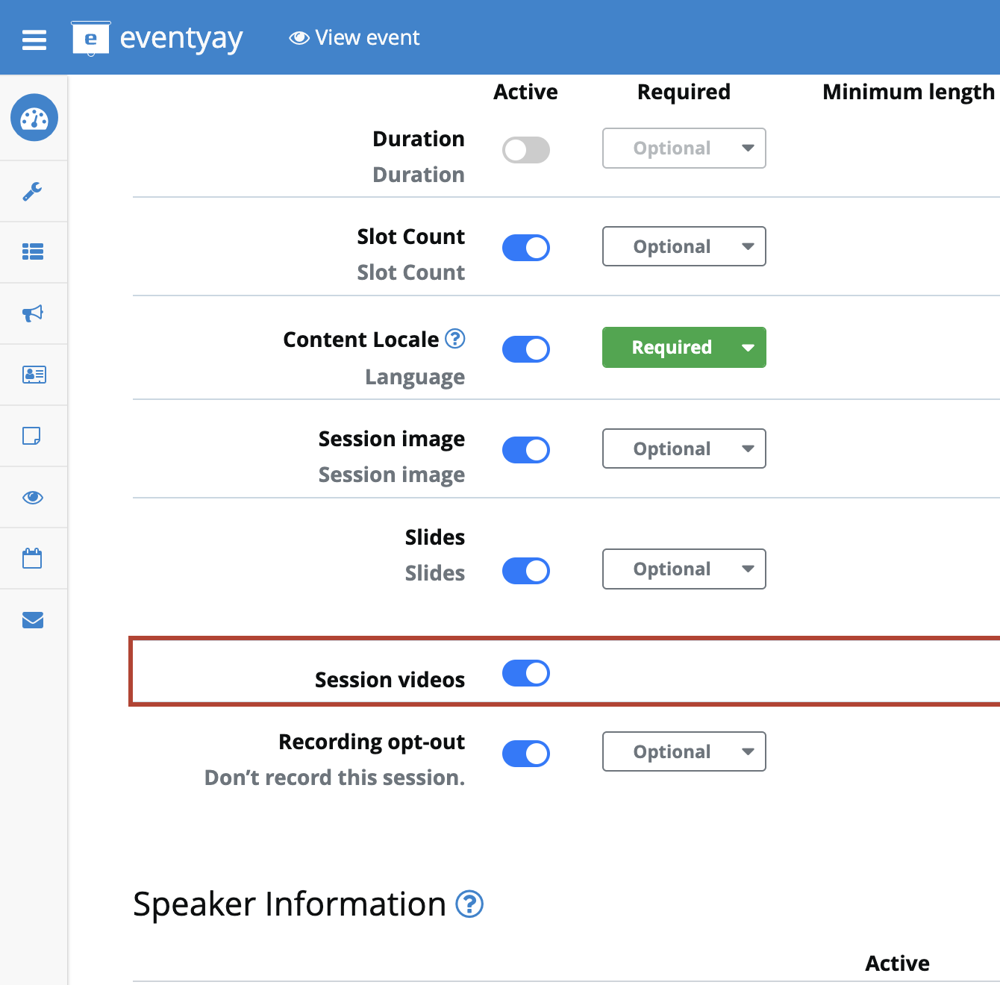
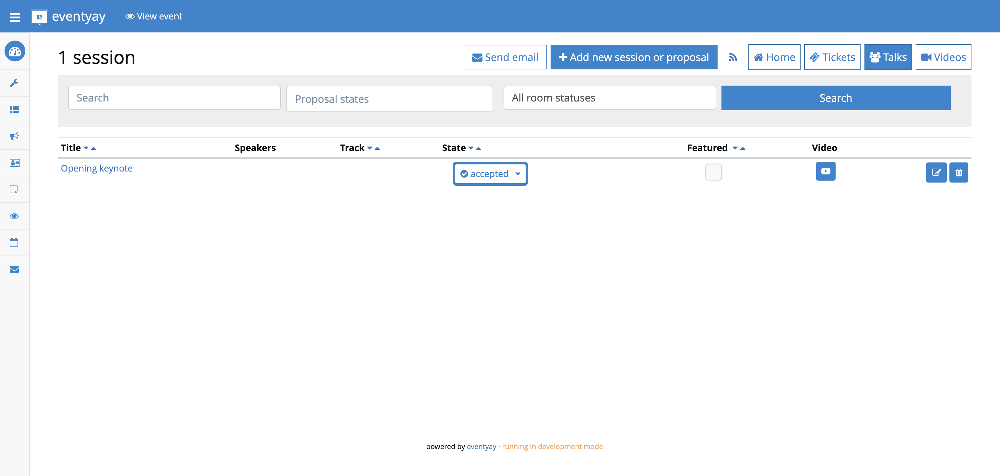
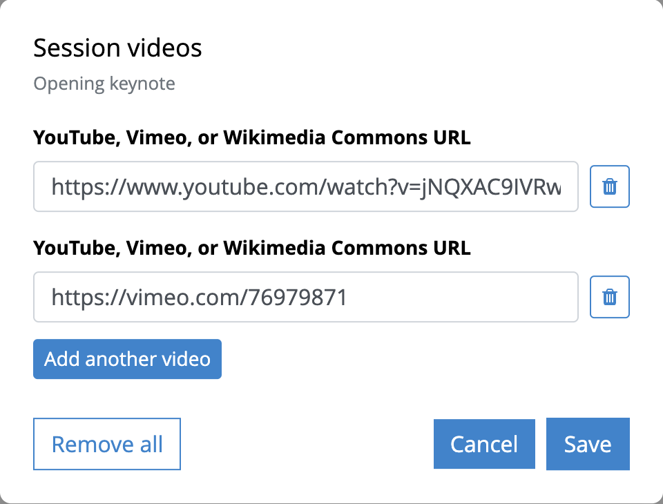
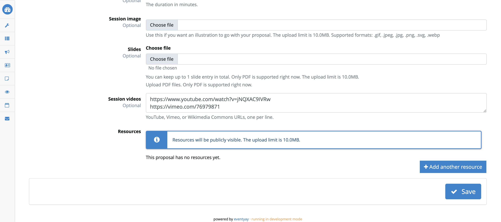
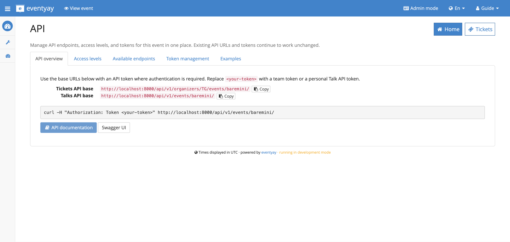
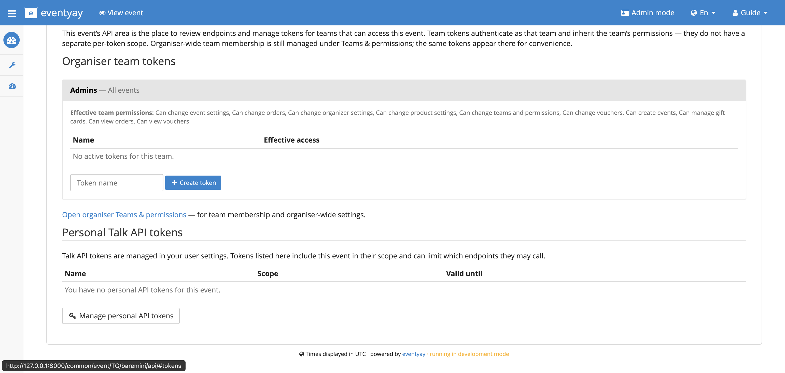
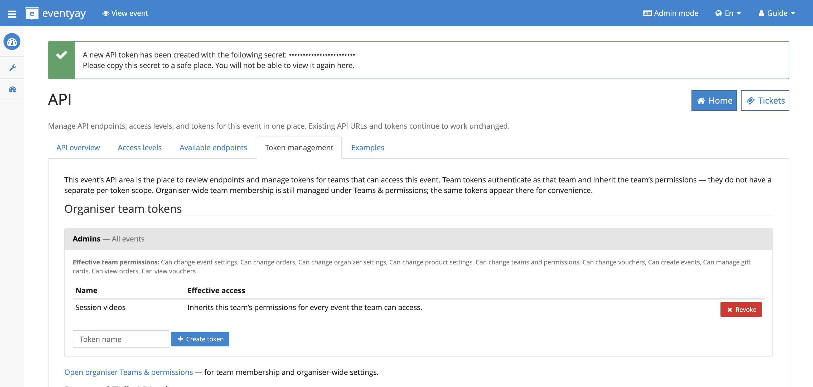
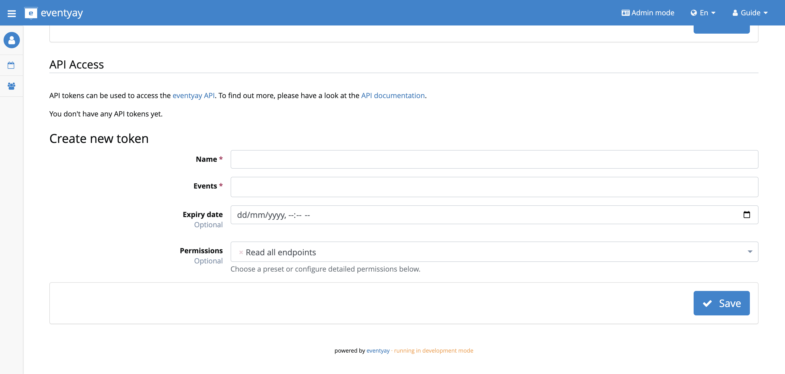
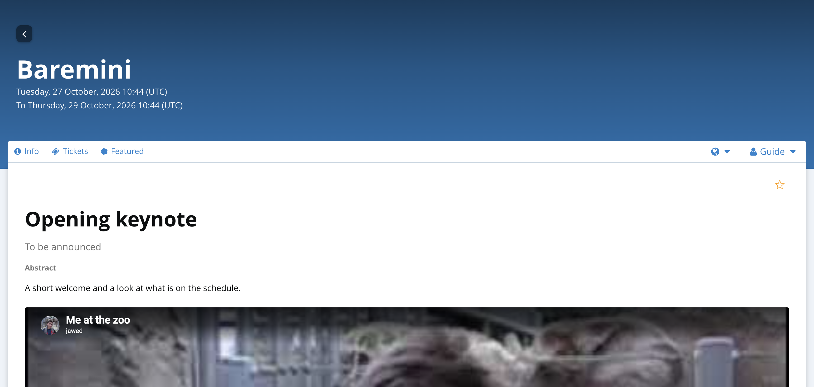

Session videos
===============

.. _`user-guide-session-videos`:

Organisers can attach one or more recordings to a session. Attendees see
YouTube, Vimeo, and Wikimedia Commons links as players on the public session
page. Speakers are not asked for this field.

The same links can be saved from the organiser screens or from the Talks API.

Turn Session videos on
----------------------

1. Open the event, then open **Talks**.
2. Open **Call for Proposals**, then **Forms**.

   The address is ``/orga/event/ORGANIZER/EVENT/cfp/questions/``.

3. Scroll to the **Session videos** row. It sits under **Slides**. It has an
   **Active** switch and no Required or Public column.
4. Turn the switch on, then click **Save** at the bottom of the page.

Until you save, the Sessions list has no Video column, and the public page
and the API do not show the links.

Add links in the organiser area
-------------------------------

Open **Sessions**.

The address is ``/orga/event/ORGANIZER/EVENT/submissions/``.

Each row has a **Video** button. In the example below the event has one
accepted session, Opening keynote.

Click the **Video** button. Paste one address in each field. Use **Add
another video** for a second recording, then click **Save**.

The session edit page stores the same links, one URL per line. Open the
session, then **Edit**.

The address is ``/orga/event/ORGANIZER/EVENT/submissions/SESSION_CODE/edit``.

The session code is the last part of the session address.

The dialog and the edit box write the same data the API writes.

Save links with the API
-----------------------

Create a token
^^^^^^^^^^^^^^

Open the event API page at ``/common/event/ORGANIZER/EVENT/api/``.

Copy the Talks API base URL. It looks like
``https://your-site/api/v1/events/EVENT/``.

Under **Token management**, type a name and click **Create token**. The
secret is shown once. Copy it. You cannot open it again. Revoke the token
from the same list when you no longer need it.

A personal token is created in user settings at ``/orga/me``, under
**API Access**. That section is shown when your user belongs to a team.
Limit the token to this event and allow create, update, and delete on
answers.

Send it on every request::

    Authorization: Token YOUR_TOKEN

Team tokens are described in :doc:`Token-based authentication
</api-reference/tokenauth>`. Talk tokens are described in :doc:`API principles
</api-reference/talk-fundamentals>`.

Third-party service
^^^^^^^^^^^^^^^^^^^

If another product calls the API for an organiser, that product uses OAuth:

1. Open **Account**, then **OAuth applications**, then **Manage your own apps**.

   .. image:: images/10-oauth-apps.png
      :alt: OAuth applications page with Register a new application
      :width: 720px
      :class: screenshot

2. Create an application. Save the client id and client secret. They are
   shown after you save. The form asks for a name and the redirection URIs
   of the other product.

   .. image:: images/11-oauth-register.png
      :alt: Register a new OAuth application form
      :width: 720px
      :class: screenshot

3. Send the organiser through the connect flow with the ``write`` scope.
4. Call the same URLs below with ``Authorization: Bearer ACCESS_TOKEN``.

The access token lasts one day. Use the refresh token to get a new one.
The full flow is in :doc:`OAuth authentication </api-reference/oauth>`.

Find the video question
^^^^^^^^^^^^^^^^^^^^^^^

::

    GET /api/v1/events/EVENT/talkquestions/?variant=video
    Authorization: Token YOUR_TOKEN

Use the ``id`` of the active video question in the next call.

Save the links
^^^^^^^^^^^^^^

Put one URL per line in ``answer``. Calling this again for the same question
and session replaces the previous text.

::

    POST /api/v1/events/EVENT/answers/
    Authorization: Token YOUR_TOKEN
    Content-Type: application/json

    {
      "question": 12,
      "submission": "SESSION_CODE",
      "answer": "https://www.youtube.com/watch?v=VIDEO_ID\nhttps://vimeo.com/76979871"
    }

A successful call returns HTTP 201 and includes the new answer id. Creating
a link with a write token returns HTTP 201, and reading it back returns
HTTP 200.

The answers API stores the text you send. Only YouTube, Vimeo, and Wikimedia
Commons file pages become players. A link such as ``https://example.com/not-a-video``
is saved and is not shown as a player.

Change or remove the links::

    PATCH /api/v1/events/EVENT/answers/ANSWER_ID/
    { "answer": "https://vimeo.com/76979871" }

    DELETE /api/v1/events/EVENT/answers/ANSWER_ID/

Read them back::

    GET /api/v1/events/EVENT/answers/?submission=SESSION_CODE

Check the public page
---------------------

Open the public session page once the session is public::

    /ORGANIZER/EVENT/talk/SESSION_CODE/

A session becomes public when it is on a published schedule, or when it is
marked featured and **Talk settings** has **Show featured sessions** set to
**Always** (or to the matching schedule option). Each embeddable line is a
player. Nothing starts until the viewer presses play. A timestamp on the URL
is kept.

These addresses embed:

* YouTube watch, ``youtu.be``, embed, or shorts links. Time: ``&t=90``,
  ``&t=1m30s``, ``&start=125``, or ``#t=30``.
* Vimeo, for example ``https://vimeo.com/76979871``. Time: ``#t=1m30s`` or
  ``?t=75``.
* A Wikimedia Commons file page whose file is webm, ogv, ogg, mp4, m4v,
  mpeg, or mpg.

Other addresses are stored but do not become players. If the session is not
public yet, the talk page is not available. The organiser session page still
lists the saved links.
